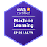

# Certifications
 

**MLS-C01 \- AWS Certified Machine Learning \- Specialty**
- An advanced-level certification validating a candidate's ability to design, implement, deploy, and maintain machine learning solutions on AWS using a wide array of available services.

**Deep Learning NanoDegree (Udacity) with TensorFlow and Keras**
- DNN, CNN, RNN, LSTM, GRU, GAN, DCGAN, Deep Q-Learning (RL) 
- Projects developed:
  - Generated Synthetic faces using Deep Convolutional Generative Adversarial Network.  
  - Trained an Autonomous Quadcopter using Deep Q Learning.

**Machine Learning Stanford University (Coursera) using MATLAB**
- Linear Regression, Logistic Regression, Artificial Neural Network. Support Vector Machine, Unsupervised Learning and Anomaly Detection. Movie Recommender System.

# Open-Source Contributions
- Developed an [Hierarchical Semantic Chunking Algorithm](https://github.com/bankawat1/hierarchical_semantic_chunking/tree/main) for smaller context window problem with LLMs.

# Skills
### Machine Learning
**Classical Machine Learning** 
  - Linear Regression, Logistic Regression, Support Vector Machines, Unsupervised Learning, Anomaly Detection

**Deep Learning** 
  - DNN, CNN, RNN, LSTM, GRU, GAN, DCGAN
 
**Reinforcement Learning** 
  - DQ-Learning, Q-Learning, DQN, Policy Gradient, Actor-Critic

**NLP:** 
  - NLP, NLI, NLU, NLG, NLTK, spaCy, BERT, GPT.

**Tools and Libraries:** 
  - TensorFlow, Keras, PyTorch, scikit-learn, XGBoost, LightGBM
 
**Cloud Computing** 
  - AWS Certified Machine Learning \- Specialty
  - Implied knowledge of other AWS services like S3, EC2, EMR, Sagemaker, AWS Glue, AWS Athena, etc.

**Software Engineering Languages:** 
  - Python, C\#.NET,  Java

**Databases:** 
  - SQLServer, MongoDB

**Other Tools:** 
  - Git, Docker, REST  APIs

**Data Analysis and Visualization Tools:** 
  - Pandas, NumPy, SQL, Matplotlib, Seaborn, Plotly

**Techniques:** 
  - Hypothesis Testing, Bayesian Inference, Regression Analysis
     
**Big Data Technologies:** 
  - Hadoop, Spark, Kafka
    
**Domain Expertise Finance/Banking:** 
  - Experience in core banking, FX prime brokerage, and general banking domain knowledge.

# Professional Experience
**Senior Data Scientist, Natwest Group**
_Gurgaon, India,  Dec 2022 \- until present day_
- Having exposure to Webchats and Telephony transcriptions data set. Designed and implemented an LLM benchmarking utility in the bank domain.
- Built a Semantic Chunking Algorithm for smaller context window problem with LLMs. Built LLM Guardrails for capturing confabulation/Hallucination in LLM generated summaries. 
- Productionized LLM AutoSumm using OpenAI’s GPT3.5v0125 to support Automatic Summarization; being used by 300+ users of the Coutts Bank.
- Executing Alpha development for Compliance and Financial Health Check Use cases. 
- Supporting Auto-Summarization MLOps & post-live challenges.
- Supporting Machine Learning Engineers to build, deploy, and monitor sagemaker pipelines for Coutts Risk Use case.

**Data Scientist, Natwest Group**
_Gurgaon, India,  May 2019 – Dec 2022_
- Trained & deployed 17 hierarchical classification models into production simultaneously, saving $200,000+. \~20x Perforamance gain \- by deploying SageMaker Tensorflow Serving container. 
- Developed a PII Masking Utility currently utilized by 17+ teams. 
- Automatic summarization \- saving 1600+ hours per Agent per month. 
- Developed a Synthetic Conversations Generation Utility to create bank-wide benchmarking datasets. 
- Guiding and supporting ML Engineers. Troubleshooting post-live mode/data drift issues. Critically evaluating Model/Data Monitoring processes for other teams.

**Software Engineer – Machine Learning, Natwest Group**
 
_Gurgaon, India, Oct 2017 – May 2019_
_(Secondments)_
- Troubleshooting Model Training and deployment issues. Preparing model release and model maintenance documents. 
- Participating and contributing to model review processes. 
- Participating in Design and Code reviews. Delivering Machine Learning training and Demos to businesses.
- Researching and presenting the latest literature to Senior Management.

**Software Designer, Natwest Group**
_Gurgaon, India,  May 2016 – May 2019_
- Built a highly parallelized multi-threaded application for FX Prime Brokerage. 
 
**Senior Software Engineer, NIIT Technologies Ltd** 
_Gurgaon, India,   Sep 2015 – May 2016_
- Built Restful services & UI framework  \- Insurance domain. 
 
**Senior Software Engineer, Fidelity Information Services**
_Gurgaon, India, Aug 2013 – Aug 2015_
- Supported and enhanced a Core Banking Product.  
 
 **Software Engineer, AONHewitt**
 
 _Gurgaon, India,  Aug 2011 – Sep 2013_
 - Overhauled UI framework using PRISM, SQL Server, Visual Studio and TFS.
 
 # Education 
 - Master of Science in Information Technology, Sep 2009 - Sept 2010, Edinburgh, United Kingdom 
 - Bachelor of Engineering in Computer Science, Jun 2005 - Jun 2009, Bengaluru, India

# Recent projects:
Below is a list of the projects that I worked on until recently as part of deliveries done in my current organization i.e., Natwest Group.

## Compliance Elements Identifier
- **Objective** – Gauge bank’s agents/RM compliance score.
- **Deliverable** – SageMaker Inference pipeline using GPT 3.5 Turbo.
- **Impact** – Increased compliance coverage from current 6% to ~80%.
- **Skills acquired** – ChatGPT, Langchain, Prompt Engineering, LLM Monitoring, dealing with context window > 4096 tokens.
- **My roles & responsibilities**:
  - Evaluating GPT 3.5 Turbo for the desired task using custom benchmarking metrics.
  - Integrating GPT3.5 into SageMaker inference pipeline.
  - Developed (LLM)model monitoring approach.
  - Recording all experiments on comet.ai tool.
  - Exploring RAG (Retrieval Augmented Generation) fitment.

## Financial Health Checks
- **Objective** – Monitor and scale Relationship Manager’s FHC Auditing.
- **Deliverable** – AWS SageMaker pipeline using Quantized LLMs.
- **Impact** – Made possible to assess 34,000 FHC Audit Reports from barely 1200/month at present.
- **Skills acquired** – Langchain, Prompt Engineering, Model Quantization (LLM used – LLAMA2 70b – 4 bit quantized), LLM fine-tuning (LLLMA2 13b), GPU Enabled AMIs, LLM model explainability, Knowledge Graph.
- **My roles & responsibilities**:
  - Used GPU enabled custom ECR Images to leverage powerful Sagemaker Studio Kernels on p3.8xLarge, g4dn.48xLarge.
  - Designing Prompts that generalises well for most of the data (Transcribed Conversations)
  - Pre-processing & postprocessing of prompts-responses.
  - Integrating LLM into SageMaker inference pipeline.

## LLMs Benchmarking
- **Objective** – Evaluate and Benchmark LLM on NLP tasks. (Dolly 3b, MPT 7b Instruct) (LLAMA2 7b, LLAMA2 13b, LLAMA2 13b 4 bit, LLAMA2 70b 4 bit, LLAMA2 70b)
- **Deliverable** – Generate Quantitative and Qualitative results for reference across the Natwest.
- **Impact** – Empirical evidence recorded for future reference.
- **Skills acquired** – Prompts Optimization and fine-tuning, LLM performance metrics discovery.
- **My roles & responsibilities**:
  - Evaluate all the available LLMs and their variants on a common set of benchmarks.
  - Measure the instruct version’s performance with few shots learning, k= {0,1,20}

## Agent’s Overdue Actions
- **Objective** – Using Open-source LLMs to extract actions pending for Agents by monitoring ~60k conversations across various channels (webchat, Telephony) daily.
- **Deliverable** – SageMaker pipeline using a Hybrid approach coupling Rule based engine & Ensemble methods with MPT 7b.
- **Impact** – Identified ~2% pending actions conversations left unnoticed.
- **Skills acquired** – LLE, PCA, Truncated SVD, t-sne, tf-idf, Fine Tuning LLMs, AWS codepipeline, Pytorch, Autoencoders, Transformer architectures.
- **My roles & responsibilities**:
  - Performed EDA; removed noise; augmented data using semi-automatic labelling.
  - Raised accuracy of the Ensemble model from 40% to 89%.
  - Built and deployed separate models, for each channel, using SageMaker pipelines.

## Sentiment Analysis
- **Objective** – Identify the sentiment at sentence level in a conversation.
- **Deliverable** – Inference pipeline capable of processing 3 million records in 2-3 hrs.
- **Impact** – For each customer a sentiment Profile is created.
- **Skills acquired** – SageMaker pipelines, AWS ECR Images, SageMaker Models, BERT, LSTM, Tensorflow Serving Containers, Tensorflow RestAPI, SageMaker Tensorflow API, Multi GPU inference, aws EMR.
- **My roles & responsibilities**:
  - Built SageMaker training and inference pipelines.
  - Orchestrated Massive parallelization framework with SageMaker Tensorflow API.
  - Brought down inference time from 150 hrs to under 3 hours. 50x improvement.
  - Productionized the models.

## PII(Personal Identifiable Info) Masking
- **Objective** – Build a utility for removing sensitive information from any text.
- **Deliverable** – Python package hosted on a PyPi like environment (Nexus).
- **Impact** – Utility downloaded 110+ times.
- **Skills acquired** – Hugging face bert-base-NER, Named Entity Recognition.
- **My roles & responsibilities**:
  - Evaluated model’s performance against Spacy NER model.
  - Gained improvement of ~4% with bert-base-NER.

## Hierarchical Text Classification
- **Objective** – Classify Agent-Customer transcribed interactions for 100+ categories.
- **Deliverable** – Hierarchy of 17 models doing text classification on 15k+ conversations daily.
- **Impact** – Resulting in savings of more than $200,000; removing manual labelling by 50+ agents.
- **Skills acquired** – Bayesian Optimization (HyperOpt), LightGBM, Multinomial Naïve Bayes, Support Vector Machines (SVM), n-grams, semantic extraction.
- **My roles & responsibilities**:
  - 17 models placed inside a Single Endpoint docker container - to be triggered using AWS Lambda (Batch Transformation Job)
  - In the 2nd Iteration, performance improved by another 5%.
  - Orchestrated MLOps solution for the project – for Data and Model monitoring
